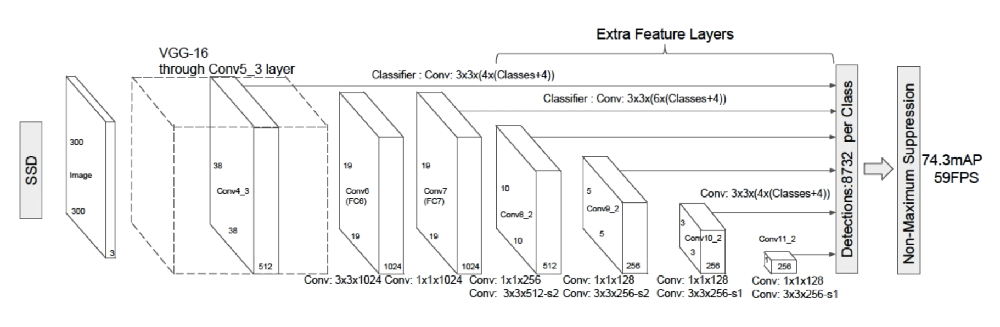
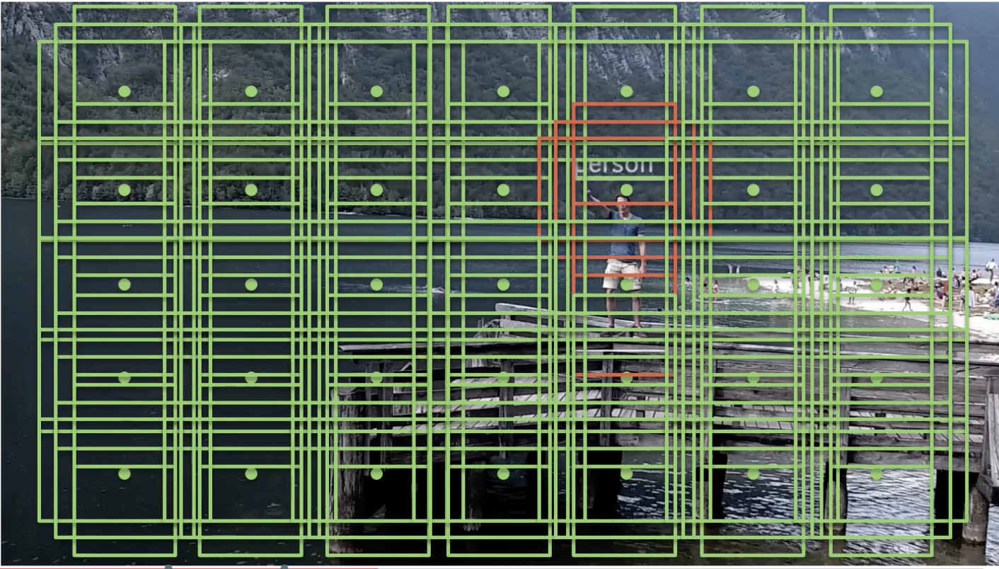
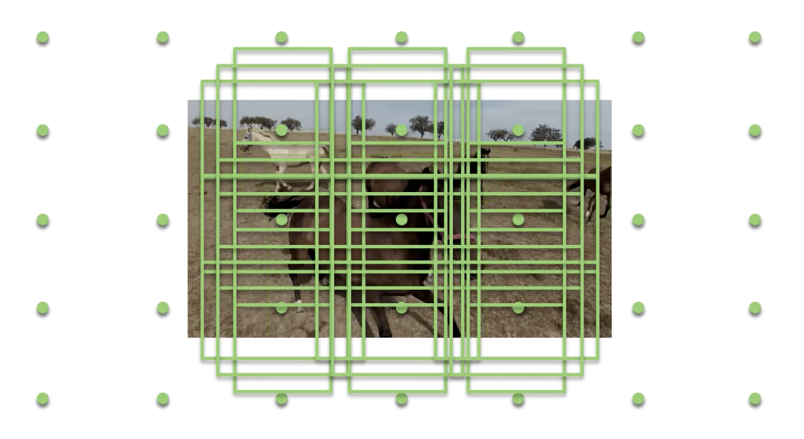

# Image-Detection
Using SSD Model
For Mac or Linux only

## Single Shot Multibox Detector

### This model is similar to YOLO (You Only Look Once) however it performed better. It is proven to be more accurate than YOLO.

## SSD uses multiple boxed to locate the image

### Any overlapped box with the image will be marked which finally will be extracted from all.

## SSD method using scaling method 

### This technique is used if the image is too close and occupy the whole box

### By rescaling the image, it prevent the image to exceeds the size of particular box